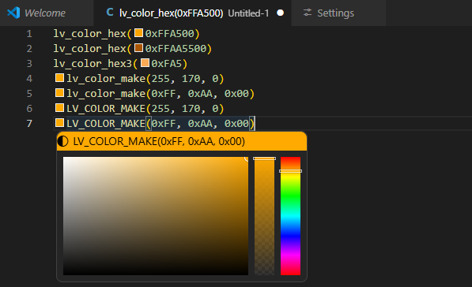
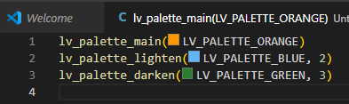

# LVGL Color Tools

LVGL-aware color decorators and color picker editing for C and C++ files in Visual Studio Code.

## What It Does

This extension recognizes supported LVGL color helper calls and lets VS Code show native color decorators only on the intended LVGL color expressions, not on unrelated numeric literals.

Supported editable forms:

```c
lv_color_hex(0xFFA500)
lv_color_hex(0xFFAA5500)
lv_color_hex3(0xFA5)
lv_color_make(255, 170, 0)
lv_color_make(0xFF, 0xAA, 0x00)
LV_COLOR_MAKE(255, 170, 0)
LV_COLOR_MAKE(0xFF, 0xAA, 0x00)
```



Optional preview-only palette forms:

```c
lv_palette_main(LV_PALETTE_ORANGE)
lv_palette_lighten(LV_PALETTE_BLUE, 2)
lv_palette_darken(LV_PALETTE_GREEN, 3)
```



Supported spacing variants:

```c
lv_color_hex(  0xFFA500 )
lv_color_hex( 0xFFAA5500 )
lv_color_hex3(0xFA5 )
lv_color_make( 255, 170, 0 )
LV_COLOR_MAKE( 0xFF, 0xAA, 0x00 )
lv_palette_lighten( LV_PALETTE_BLUE, 2 )
```

## Behavior

The extension:

- highlights only the hex token inside supported LVGL hex calls
- treats `lv_color_make(...)` and `LV_COLOR_MAKE(...)` as full-call color ranges
- uses the built-in VS Code color picker for editable forms only
- writes edited values back in uppercase LVGL-compatible syntax
- preserves the leading byte of `0xAARRGGBB` values while editing only the RGB portion
- preserves hex-byte style on writeback when the original make call used hex byte arguments
- can optionally show preview-only swatches for literal palette calls without opening the color picker
- ignores unrelated hex literals such as `0xFFA500` outside the supported functions

Examples that should be decorated:

```c
lv_color_t orange = lv_color_hex(0xFFA500);
lv_color_t packed = lv_color_hex(0xFFAAAAAA);
lv_color_t soft = lv_color_hex( 0xAABBCC );
lv_color_t shortc = lv_color_hex3(0xFA5);
lv_color_t made_dec = lv_color_make(255, 170, 0);
lv_color_t made_hex = lv_color_make(0xFF, 0xAA, 0x00);
lv_color_t macro_dec = LV_COLOR_MAKE(255, 170, 0);
lv_color_t macro_hex = LV_COLOR_MAKE(0xFF, 0xAA, 0x00);
lv_color_t palette_main = lv_palette_main(LV_PALETTE_ORANGE);
lv_color_t palette_light = lv_palette_lighten(LV_PALETTE_BLUE, 2);
```

Examples that should not be decorated:

```c
uint32_t mask = 0xFFA500;
#define MY_HEX 0x123456
foo(0xABCDEF);
foo(255, 170, 0);
"lv_color_hex(0xFFA500)"
/* LV_COLOR_MAKE(0xFF, 0xAA, 0x00) */
```

## Extension Settings

The extension contributes these settings:

```json
{
  "lvglColorTools.enableColorMakeMacro": true,
  "lvglColorTools.enablePaletteDecorators": false
}
```

Behavior of each setting:

- `lvglColorTools.enableColorMakeMacro`: enables or disables support for `LV_COLOR_MAKE(...)`.
- `lvglColorTools.enablePaletteDecorators`: enables preview-only swatches for `lv_palette_main(...)`, `lv_palette_lighten(...)`, and `lv_palette_darken(...)` when their arguments are literal palette enums and literal levels.

## Current Scope

The MVP intentionally does not support:

- nested macros
- computed expressions
- variables passed to LVGL color helpers
- palette editing through the color picker
- non-literal arguments inside `lv_color_make(...)` or `LV_COLOR_MAKE(...)`
- non-literal palette enums or computed palette levels
- custom wrapper macros or functions

## Implementation Notes

The extension uses a `DocumentColorProvider` registered for `c` and `cpp` for editable LVGL forms.

Palette previews intentionally use normal editor decorations instead of the color-provider pipeline. This avoids the misleading VS Code color picker behavior for palette expressions while still showing a visible swatch.

Detection is based on lightweight regex scanning plus a small text sanitizer that blanks out comments and quoted strings before matching. That keeps the implementation simple while avoiding the most obvious false positives.

For `lv_color_hex3(...)`, edited colors are quantized back to 12-bit RGB so the result stays valid as `0xRGB`.

For `lv_color_hex(0xAARRGGBB)`, the highest byte is treated as passthrough metadata. The color preview and picker use only `RRGGBB`, and edited values keep the original `AA` byte unchanged.

For `lv_color_make(...)` and `LV_COLOR_MAKE(...)`, decimal byte literals and hex byte literals are recognized in this version. Color-picker edits rewrite the full call and preserve hex-byte style when the original call used hex byte arguments.

For palette calls, the extension uses the LVGL palette definitions and shows preview-only swatches. Palette expressions intentionally do not offer color picker editing in this version.

## Project Structure

```text
.
|-- .github/
|   `-- workflows/
|       |-- ci.yml
|       `-- release.yml
|-- .vscode/
|   |-- launch.json
|   `-- tasks.json
|-- src/
|   |-- extension.ts
|   |-- lvglColorCore.ts
|   |-- lvglColorProvider.ts
|   `-- lvglPaletteDecorator.ts
|-- test/
|   `-- lvglColorCore.test.ts
|-- CHANGELOG.md
|-- package.json
|-- readme.md
|-- tsconfig.json
`-- tsconfig.test.json
```

## Build

Install dependencies:

```bash
npm install
```

Compile once:

```bash
npm run compile
```

Watch mode:

```bash
npm run watch
```

Run tests:

```bash
npm test
```

Package a VSIX:

```bash
npm run package
```

## GitHub Actions

The repository includes two workflows:

- `ci.yml` runs on pushes to `master` and on pull requests. It installs dependencies, runs the test suite, builds the VSIX, and uploads the VSIX as a workflow artifact.
- `release.yml` runs when you push a tag matching `v*`. It installs dependencies, runs the test suite, builds the VSIX, creates a GitHub Release, and uploads the VSIX as a release asset.

Example release flow:

```bash
git tag v0.1.0
git push origin v0.1.0
```

## Run In VS Code

1. Open this folder in VS Code.
2. Run `npm install`.
3. Run `npm run compile` or start the watcher.
4. Press `F5` to launch an Extension Development Host.
5. Open a C or C++ file containing supported LVGL color calls.
6. If you want palette swatches, enable `lvglColorTools.enablePaletteDecorators` in settings.

## Known Limitations

- Parsing is regex-based rather than AST-based.
- The comment/string sanitizer is intentionally lightweight and may not cover every edge case in preprocessor-heavy code.
- `lv_color_hex3(...)` edits are rounded to the nearest representable 12-bit color.
- `0xAARRGGBB` support treats `AA` as preserved metadata rather than an editable alpha channel.
- Palette support is preview-only and requires literal palette arguments.
- `lv_palette_lighten(...)` and `lv_palette_darken(...)` only accept literal levels in the LVGL-documented ranges.

## Next Improvements

- configurable function lists instead of boolean feature toggles only
- preserve mixed per-channel formatting in `lv_color_make(...)` and `LV_COLOR_MAKE(...)`
- stronger parsing for edge cases
- broader numeric literal support if LVGL codebases need it
- optional project detection for LVGL workspaces

## 🤖 AI Disclosure & Disclaimer

This VS Code extension for **LVGL** was developed as an experiment in AI-driven software creation.

- **Authorship:** Approximately 100% of the codebase was generated using **ChatGPT 5.4** (GPT-5.4 Thinking).
- **Vetting:** While the core functionality has been tested for standard LVGL workflows, the code has not undergone a full manual security or performance audit.
- **Usage Warning:** Users are advised to review the extension's behavior within their specific LVGL environment. This project is provided "as-is," and the maintainer is not responsible for any bugs, data loss, or "hallucinations" inherent to AI-generated code.
